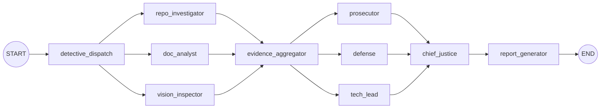

# Architecture Notes

This project implements a digital courtroom auditor using LangGraph with a detective layer, a judicial layer, and a chief justice synthesis engine. The design prioritizes parallel evidence collection, structured judicial opinions, and deterministic report generation.

## High-Level Flow

The system is orchestrated in `src/graph.py` using fan-out/fan-in and conditional routing:

Conditional routing after `evidence_aggregator` retries detectives if evidence errors are detected.

## Detective Layer

Implemented in `src/nodes/detectives.py`:

- RepoInvestigator: clones the repo, analyzes git history and code structure.
- DocAnalyst: extracts PDF text and runs concept retrieval for key terms.
- VisionInspector: analyzes diagrams if images are available.

Evidence objects are stored in `ForensicEvidenceCollection` (`src/state.py`), and the raw evidence is retained for traceability.

## Judicial Layer

Implemented in `src/nodes/judges.py`:

- Prosecutor, Defense, Tech Lead personas with distinct prompts.
- Structured output enforced by `PydanticOutputParser` and strict JSON output.

Each judge scores every rubric dimension and emits a `JudicialOpinion`.

## Chief Justice Synthesis

Implemented in `src/nodes/justice.py`:

- Resolves conflicts using Rule of Security and Rule of Fact.
- Produces `FinalVerdict` per criterion and a narrative summary.

## Report Artifacts

Generated by `src/graph.py`:

- Executive summary with scores.
- Evidence summary.
- Per-criterion narrative, dissent, and remediation plan.
- Consolidated remediation plan section.

Reports are written to `audit/report_YYYYMMDD_HHMMSS.md`.

## Key Files

- `src/graph.py`: graph orchestration and report generation.
- `src/state.py`: typed state and evidence models.
- `src/nodes/detectives.py`: detective layer.
- `src/nodes/judges.py`: judicial layer with structured output.
- `src/nodes/justice.py`: chief justice synthesis.

