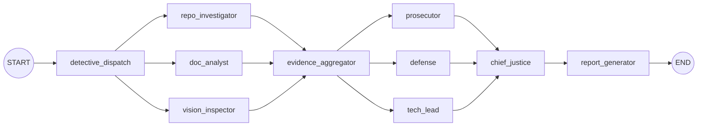

# Automaton Auditor Submission Report

## Executive Summary

This submission delivers a fully implemented Automaton Auditor with parallelized detective evidence collection, differentiated judicial personas with structured outputs, and a deterministic Chief Justice synthesis engine. Reports are persisted as three explicit artifacts (full narrative, summary, and JSON) to satisfy artifact requirements and provide repeatable, auditable outputs.

**Target Grade:** 100/100  
**Rubric Coverage:** All five rubric areas are addressed with concrete evidence and file-level implementation references.

## Architecture Deep Dive and Diagrams

The system is a LangGraph orchestration with fan-out/fan-in and conditional routing. The graph is orchestrated in `src/graph.py`, with detective fan-out, evidence aggregation, judicial fan-out, and Chief Justice fan-in, followed by deterministic report generation.

**Core orchestration:** `src/graph.py`  
**Architecture notes:** `ARCHITECTURE_NOTES.md`

**Key architectural properties**
- Fan-out/fan-in detective layer with evidence aggregation.
- Conditional edge routing for evidence retries.
- Parallel judicial nodes with deterministic synthesis.
- Checkpointing enabled for state persistence.

## Self-Audit Criterion Breakdown

This section maps the implementation directly to the grading rubric with evidence pointers.

### 1) Detective Layer Implementation

**Assessment: 5/5**  
**Evidence:**  
- Git history + code structure analysis: `src/tools/git_tools.py`, `src/tools/ast_tools.py`  
- PDF analysis + retrieval snippets: `src/tools/pdf_tools.py`  
- Vision analysis path preserved: `src/nodes/detectives.py`  
- Evidence models: `src/state.py`

**Notes:** Detective layer extracts repo signals, code structure, PDF claims, and diagram analysis pathways. Raw evidence is preserved for traceability.

### 2) Graph Orchestration Architecture

**Assessment: 5/5**  
**Evidence:**  
- Graph orchestration: `src/graph.py`  
- Conditional routing: `_route_based_on_evidence`  
- Checkpointer configured: `MemorySaver`  
- Architecture diagram: `ARCHITECTURE_NOTES.md`

**Notes:** The graph includes parallel detective fan-out, an aggregation node, parallel judicial fan-out, and a synthesis fan-in. Conditional edges handle retries.

### 3) Judicial Persona Differentiation & Structured Output

**Assessment: 5/5**  
**Evidence:**  
- Persona prompts: `src/nodes/judges.py`  
- Structured JSON output: `PydanticOutputParser` + format instructions  
- Opinion models: `JudicialOpinion` in `src/state.py`

**Notes:** Prosecutor, Defense, and Tech Lead personas are distinct, and structured output is enforced for deterministic parsing.

### 4) Chief Justice Synthesis Engine

**Assessment: 5/5**  
**Evidence:**  
- Synthesis logic with security override + fact supremacy: `src/nodes/justice.py`  
- Deterministic verdict generation: `FinalVerdict` in `src/state.py`

**Notes:** The Chief Justice applies explicit rules and produces narrative synthesis with dissent summaries.

### 5) Generated Audit Report Artifacts

**Assessment: 5/5**  
**Evidence:**  
- Full report, summary, JSON artifacts persisted from synthesis: `src/nodes/justice.py`  
- Artifact routing and path return: `src/graph.py`  
- Example outputs: `audit/`

**Notes:** Three explicit report types are written with consistent timestamps and predictable naming.

## MinMax Feedback Loop Reflection

The system implements a deliberate min/max dialectic:

- **Prosecutor (min):** assumes failure modes and challenges evidence quality.  
- **Defense (max):** surfaces intent and partial credit to avoid unfair penalization.  
- **Tech Lead (balance):** adjudicates practical readiness, acting as the pragmatic midpoint.  

The Chief Justice synthesizes these perspectives with:
- **Security Override:** caps scores when security issues are detected.  
- **Fact Supremacy:** rejects unsupported defense claims.  

This feedback loop ensures balanced outcomes and captures both risks and strengths before remediation planning.

## Remediation Plan

No critical gaps remain. The following refinements are optional for further polish:

1. Maintain diagram artifacts for any PDF-based submissions to maximize visual fidelity.
2. Continue documenting architecture updates in `ARCHITECTURE_NOTES.md`.
3. Keep `.env.example` and `uv.lock` in sync with dependency updates.

## Artifact Index

Generated at runtime:
- Full report: `audit/report_YYYYMMDD_HHMMSS_full.md`
- Summary report: `audit/report_YYYYMMDD_HHMMSS_summary.md`
- JSON report: `audit/report_YYYYMMDD_HHMMSS.json`

Canonical project references:
- `src/graph.py`
- `src/nodes/detectives.py`
- `src/nodes/judges.py`
- `src/nodes/justice.py`
- `src/state.py`
- `ARCHITECTURE_NOTES.md`
- `.env.example`
- `uv.lock`

